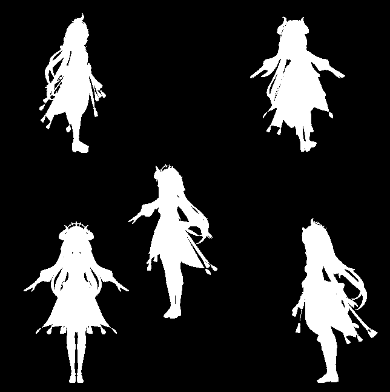
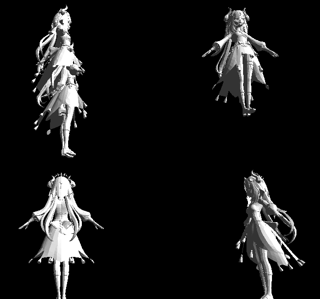
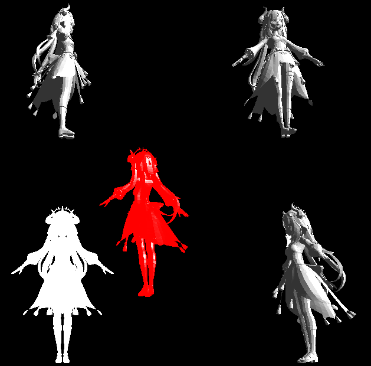
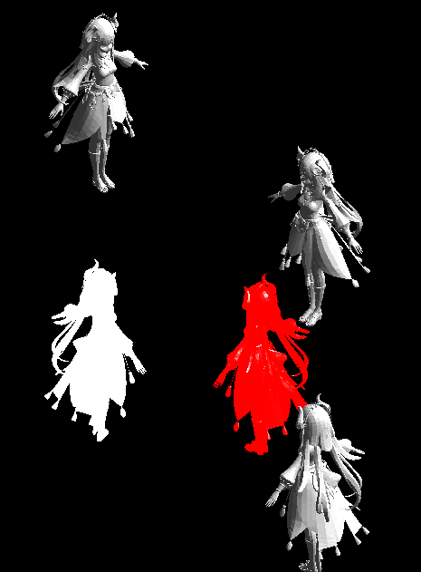
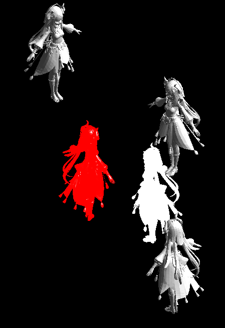
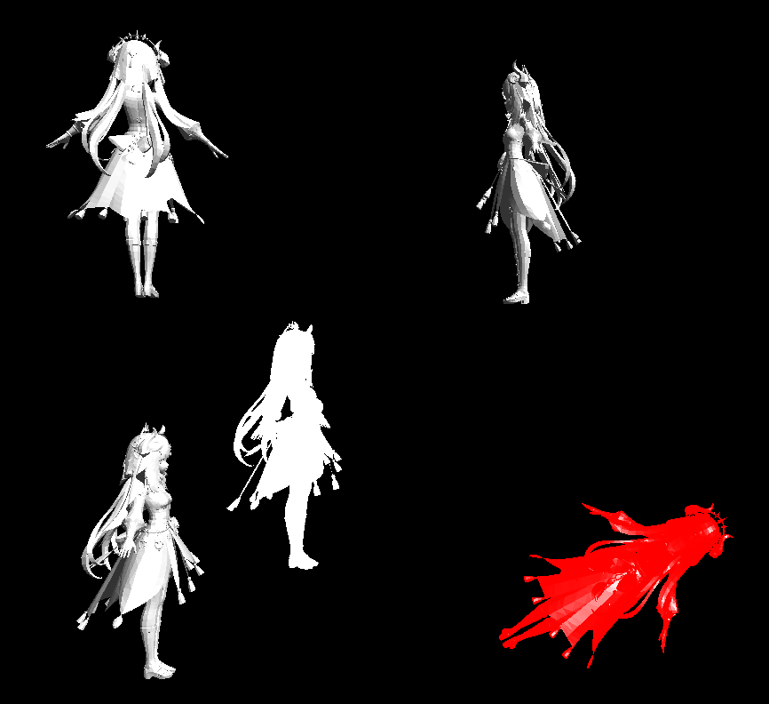
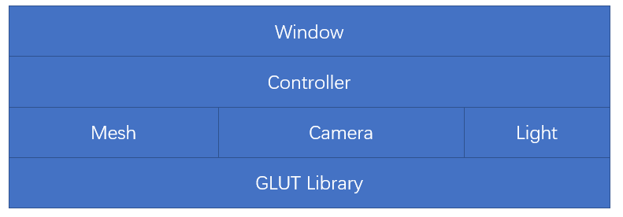
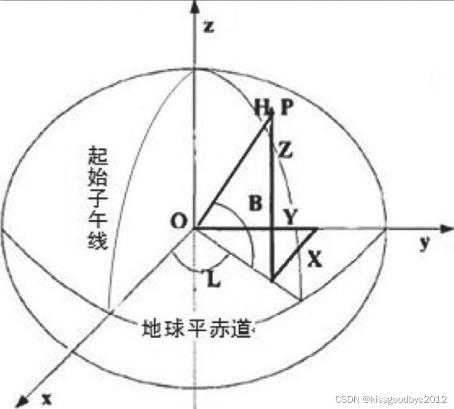

# 图形学大作业 实验报告

**202022300317 杨业昶 **

## 效果展示

> 无光照效果



> 有光照效果



> 透视投影效果



> 平行投影效果



> 平移操作



> 旋转操作



## 运行方式

### 完整代码

[yyc001/obj-viewer: load .obj and display based on OpenGL GLUT (github.com)](https://github.com/yyc001/obj-viewer)

### 运行环境

- OS: Ubuntu 20.04
- gcc: gcc version 9.4.0 (Ubuntu 9.4.0-1ubuntu1~20.04.1) 

### start shell

```shell
sudo apt install make gcc freeglut3-dev
make
```

## 功能实现

#### 从`.obj` 文件中读取模型

`.obj` 文件是文本文件， 包含模型的几何信息，可以按照文本文件的方式读取。

这一部分借鉴了 [Traditional-3D-Model-Viewer](https://github.com/vncentwu/Traditional-3D-Model-Viewer) 的实现方式，将从文件读取的数据存储到mesh object 里面。

`.obj` 文件格式：

```
# 对点位置的定义
v xxx xxx xxx
# 对面的定义
f x/x/x x/x/x x/x/x
```

用 `std::vector` 存储几何体各个表面。

```cpp
vector<vector<int> > faces;
vector<vector<float> > vertices;
vector<vector<float> > faces_normals;
```

#### 模型的展示

本程序的对象结构如下：



窗口（`class Windowing`）封装了 GLUT 初始化、主循环和回调函数。窗口将 GLUT 事件分发给各个控制器 （`Controller`），控制器接收事件并改变渲染对象的参数。

1. 定义窗口

```cpp
class Windowing{
    public:
    CameraController *cc;
    std::vector< Trimesh* > meshes;
    int active_mesh, fps, ltick;
    Picker *picker;
    int light;
    void init();
    void display();
    void reshape(int width, int height);
    void keyboard(unsigned char key, int x, int y);
    void motion(int x, int y);
    void passiveMotion(int x, int y);
    void mouse(int button, int state, int x, int y);
    void special(int key, int x, int y);
    void idle();
    void mainLoop();
};
```

2. 窗口初始化

初始化部分对窗口大小、窗口位置进行了设置，并启用灯光。

本程序采用了图像双缓冲区 `GLUT_DOUBLE`，启用了环境光和 `GL_LIGHT0`。

```c++
void Windowing::init()
{
	glutInitWindowSize(400.f, 300.f);
	glutInitWindowPosition(100,100);
	glColorMaterial(GL_FRONT_AND_BACK, GL_AMBIENT_AND_DIFFUSE);
	glutCreateWindow("Object loader");
	glutInitDisplayMode(GLUT_DOUBLE);
	
    glClearDepth(1.0f);
	glDepthFunc(GL_LEQUAL);
	glEnable(GL_COLOR_MATERIAL);
	glHint(GL_PERSPECTIVE_CORRECTION_HINT, GL_NICEST);

        //材质反光性设置
    GLfloat mat_specular[] = { 1.0, 1.0, 1.0, 1.0 };  //镜面反射参数
    GLfloat mat_shininess[] = { 50.0 };               //高光指数
    GLfloat light_position[] = { 1.0, 1.0, 1.0, 0.0 };
    GLfloat white_light[] = { 1.0, 1.0, 1.0, 1.0 };   //灯位置(1,1,1), 最后1-开关
    GLfloat Light_Model_Ambient[] = { 0.2, 0.2, 0.2, 1.0 }; //环境光参数

    glClearColor(0.0, 0.0, 0.0, 0.0);  //背景色
    glShadeModel(GL_SMOOTH);           //多变性填充模式

    //材质属性
    glMaterialfv(GL_FRONT, GL_SPECULAR, mat_specular);
    glMaterialfv(GL_FRONT, GL_SHININESS, mat_shininess);

    //灯光设置
    glLightfv(GL_LIGHT0, GL_POSITION, light_position);
    glLightfv(GL_LIGHT0, GL_DIFFUSE, white_light);   //散射光属性
    glLightfv(GL_LIGHT0, GL_SPECULAR, white_light);  //镜面反射光
    glLightModelfv(GL_LIGHT_MODEL_AMBIENT, Light_Model_Ambient);  //环境光参数

    glEnable(GL_LIGHTING);   //开关:使用光
    glEnable(GL_LIGHT0);     //打开0#灯
    glEnable(GL_DEPTH_TEST); //打开深度测试

}
```

3. 加载模型

```cpp
loader->loadOBJ(argv[1], &mesh1);
window.meshes.push_back(&mesh1);
```

4. 设置相机参数

相机是一个描述相机拜访位置和朝向、投影方式、视口形状的结构体。

对于投影方式，`CAMERA_PERSPECTIVE` 和 `CAMERA_FREE` 是透视投影，`CAMERA_ORTHO` 是正投影。

`CAMERA_PERSPECTIVE` 和 `CAMERA_FREE` 的区别在于物体移动的方式和视角移动的方式。

此外，为了减少重复的计算，相机中有一个 dirty 位，用来标记相机变换矩阵是否失效，若失效则意味着下一次渲染时需要重新计算相机变换矩阵，否则可以沿用已经计算完成的相机变换矩阵。

```cpp
#define CAMERA_PERSPECTIVE 1
#define CAMERA_ORTHO 2
#define CAMERA_FREE 3
struct Camera{
    float eye[3], at[3], up[3];
    int mode, width, height, dirty;
    double fovy, near, far;
    float savedmat[16];
    
    void info();
};
```

```cpp
camera = stare_at(&mesh1);
window.cc = &cc;
cc.camera = &camera;
Camera stare_at(Trimesh *mesh)
{
	Camera camera;
    // 设置相机的视点在物体中点
	vector<float> mp = mesh->middlePoint();
	camera.at[0] = mp[0];
	camera.at[1] = mp[1];
	camera.at[2] = mp[2];

    // 相机位置在与中点同一高度
	camera.eye[0] = 0;
	camera.eye[1] = mp[0];
	float diam = mesh->diam();
	camera.eye[2] = diam * 2;
    
	camera.up[0] = 0;
	camera.up[1] = 1;
	camera.up[2] = 0;

	camera.fovy = 60;
	camera.width = 400;
	camera.height = 300;
	camera.near = 0.1;
	camera.far = diam * 4;
	camera.mode = CAMERA_PERSPECTIVE;
	camera.dirty = 1;
	return camera;
}
```

5. mesh的渲染

本程序利用 GLUT 矩阵栈，对每一个mesh计算一个投影矩阵，该矩阵是相机矩阵和变换矩阵相乘。

对单个 mesh 的渲染，渲染前调用 `glPushMatrix()` 渲染后调用 `glPopMatrix()`，每个面按照三角形面片 `GL_TRIANGLES` 绘制，绘制前调用 `AnimationController` 和 `frame` 来设置该 mesh 在世界坐标系下的变换。

```c++
void Windowing::display()
{
    glClear(GL_COLOR_BUFFER_BIT | GL_DEPTH_BUFFER_BIT);
    glMatrixMode(GL_MODELVIEW);
    glLoadIdentity();
    if(light){
        glEnable(GL_LIGHTING);
        // printf("light on\n");
    } else {
        glDisable(GL_LIGHTING);
    }
    if(cc){
        cc->setCameraMat();
    }

    for(Trimesh *mesh: this->meshes) {
        if(mesh != NULL){
            mesh->display();
        }
    }
    glutSwapBuffers();
    glFlush();
}
void Trimesh::display()
{
    glMatrixMode(GL_MODELVIEW);
    glPushMatrix();
    if (enable_transformation) {
		frame.display();
    }
    if(ac){
        ac->display();
    }
	glColor4f(rgba[0], rgba[1], rgba[2], rgba[3]);
    for (unsigned i=0; i < faces.size(); i++)
    {
        glBegin(GL_TRIANGLES);
        vector<int> face = faces[i];
        vector<float> normal = faces_normals[i];
        for(unsigned j = 0; j < 3; j++) {
            glNormal3f(normal[0], normal[1], normal[2]);
            int index = face[j];
            vector<float> vertex = vertices[index];
            glVertex3f(vertex[0], vertex[1], vertex[2]);
        }
        glEnd();
    }
    glPopMatrix();
}
```

#### 投影方式的切换

1. 定义相机控制器

```cpp
class CameraController{
    public:
    struct Camera *camera;
    struct Camera reset;
    float freealpha, freetheta;
    float deltastep[3];
    int savedx, savedy;

    CameraController();
    void setCameraMat();
    void reshape(int width, int height);
    int motion(int x, int y, int pressed);
    int keyboard(unsigned char key, int x, int y);
    int special(int key, int x, int y);

};
```

2. 相机模式的切换

本程序使用键盘 F2 F3 F4 改变投影方式。

在 `CAMERA_FREE` 模式下，使用鼠标按下移动控制相机朝向，键盘 `W` `A` `S` `D ` `空格` `Tab` 控制相机上下左右前后移动。在 `CameraController` 中用相机经纬度表达相机朝向，在计算相机视点和切换渲染方式反算经纬坐标时，需要进行向量与经纬坐标之间的换算。



在 `CAMERA_PERSPECTIVE` 模式与 `CAMERA_ORTHO` 模式的切换比较简单，重设一下相机状态位即可。

```cpp
int CameraController::special(int key, int x, int y)
{
    printf("special %d %d %d\n", key, x, y);
    switch(key){
    case GLUT_KEY_F1:
        printf("hello\n");
        return 0;
    case GLUT_KEY_F2:
        camera->mode = CAMERA_FREE;
        reshape(camera->width, camera->height);
        // from camera to angle
        float shee[3];
        shee[0] = (camera->at[0]-camera->eye[0]);
        shee[1] = (-camera->at[2]+camera->eye[2]);
        // shee[2] = (camera->at[2]-camera->eye[2]);
        vecNormalize2(shee);
        freealpha = acos(shee[0]);
        if(shee[1] < 0) freealpha = 2*PI - freealpha;
        shee[0] = (camera->at[0]-camera->eye[0]);
        shee[1] = (camera->at[1]-camera->eye[1]);
        shee[2] = (camera->at[2]-camera->eye[2]);
        vecNormalize3(shee);
        freetheta = asin(shee[1]);
        return 1;
    case GLUT_KEY_F3:
        camera->mode = CAMERA_PERSPECTIVE;
        reshape(camera->width, camera->height);
        return 1;
    case GLUT_KEY_F4:
        camera->mode = CAMERA_ORTHO;
        reshape(camera->width, camera->height);
        return 1;
    }
    return 0;
}
```

4. 相机的移动

在 `CAMERA_FREE` 模式下：

键盘 `W` `A` `S` `D ` `空格` `Tab` 控制相机上下左右前后移动，这时相机的朝向不变，因此相机位置 `eye` 与视点 `at` 需要一起进行相同的移动。

前方向的计算方式时显然的，左方向需要 `up` 与前方向叉乘得到。需要注意的是，`up` 并不是移动方向的上方向，它与前方向和左方向夹角不一定是直角，需要再一次的叉乘积得到。

鼠标按下移动控制相机朝向的改变，基于移动的坐标在屏幕的占比与视角计算经纬度的改变量。

在 `CAMERA_PERSPECTIVE`  和 `CAMERA_ORTHO` 模式下：

键盘 `W` `A` `S` `D ` `空格` `Tab` 控制相机上下左右前后移动，相机视点始终不变。

```cpp
int CameraController::motion(int x, int y, int pressed)
{
    if(pressed == 0){
        savedx = x;
        savedy = y;
        return 0;
    }
    if(camera->mode == CAMERA_FREE) {
        int width = camera->width, height = camera->height;
        int dx = savedx - x , dy = savedy - y;
        if(abs(dx) < width/100 && abs(dy) < height/100){
            return 0;
            //ignore
        }
        float dalpha = (camera->fovy/180*PI)*dx/width;
        float dtheta = (camera->fovy/180*PI)*dy/height;
        freealpha += dalpha ;
        freetheta += dtheta ;
        if(freetheta > PI/2) freetheta = PI/2;
        if(freetheta < -PI/2) freetheta = -PI/2;

        camera->at[0] = camera->eye[0] + camera->far/2*cos(freealpha)*cos(freetheta);
        camera->at[1] = camera->eye[1] + camera->far/2*sin(freetheta);
        camera->at[2] = camera->eye[2] + camera->far/2*sin(-freealpha)*cos(freetheta);
        camera->dirty = 1;
        savedx = x;
        savedy = y;
        return 1;
    }
    return 0;
}
int CameraController::keyboard(unsigned char key, int x, int y)
{
    printf("keyboard [%c] %d %d %d\n", key, key, x, y);
    switch(key){
    case 'r':
    case 'R':
        memcpy(camera, &reset, sizeof(reset));
        camera->dirty=1;
        return 1;
    case 'i':
    case 'I':
        camera->info();
        return 0;

    float up[3], front[3], left[3];
    if(camera->mode == CAMERA_PERSPECTIVE || camera->mode == CAMERA_ORTHO) {
        up[0] = camera->up[0];
        up[1] = camera->up[1];
        up[2] = camera->up[2];
        front[0] = camera->at[0] - camera->eye[0];
        front[1] = camera->at[1] - camera->eye[1];
        front[2] = camera->at[2] - camera->eye[2];
        vecCross3(left, up, front);
        vecCross3(up, front, left);
        vecNormalize3(left);
        vecNormalize3(front);
        vecNormalize3(up);
        switch(key){
        case ' ':
            camera->eye[0] += up[0]*deltastep[1];
            camera->eye[1] += up[1]*deltastep[1];
            camera->eye[2] += up[2]*deltastep[1];
            camera->dirty = 1;
            return 1;
        case 9: // tab
            camera->eye[0] -= up[0]*deltastep[1];
            camera->eye[1] -= up[1]*deltastep[1];
            camera->eye[2] -= up[2]*deltastep[1];
            camera->dirty = 1;
            return 1;
        case 'A':
        case 'a':
            camera->eye[0] += left[0]*deltastep[0];
            camera->eye[1] += left[1]*deltastep[0];
            camera->eye[2] += left[2]*deltastep[0];
            camera->dirty = 1;
            return 1;
        case 'D':
        case 'd':
            camera->eye[0] -= left[0]*deltastep[0];
            camera->eye[1] -= left[1]*deltastep[0];
            camera->eye[2] -= left[2]*deltastep[0];
            camera->dirty = 1;
            return 1;
        case 'W':
        case 'w':
            camera->eye[0] += front[0]*deltastep[0];
            camera->eye[1] += front[1]*deltastep[0];
            camera->eye[2] += front[2]*deltastep[0];
            camera->dirty = 1;
            return 1;
        case 'S':
        case 's':
            camera->eye[0] -= front[0]*deltastep[0];
            camera->eye[1] -= front[1]*deltastep[0];
            camera->eye[2] -= front[2]*deltastep[0];
            camera->dirty = 1;
            return 1;
        }
    } else if (camera->mode == CAMERA_FREE) {
        camera->up[0] = up[0] = 0;
        camera->up[1] = up[1] = 1;
        camera->up[2] = up[2] = 0;
        front[0] = camera->at[0] - camera->eye[0];
        front[1] = camera->at[1] - camera->eye[1];
        front[2] = camera->at[2] - camera->eye[2];
        vecNormalize3(front);
        vecCross3(left, up, front);
        vecCross3(front, left, up);
        switch(key){
        case ' ':
            camera->eye[0] += up[0]*deltastep[1];
            camera->eye[1] += up[1]*deltastep[1];
            camera->eye[2] += up[2]*deltastep[1];
            camera->at[0] += up[0]*deltastep[1];
            camera->at[1] += up[1]*deltastep[1];
            camera->at[2] += up[2]*deltastep[1];
            camera->dirty = 1;
            return 1;
        case 9: // tab
            camera->eye[0] -= up[0]*deltastep[1];
            camera->eye[1] -= up[1]*deltastep[1];
            camera->eye[2] -= up[2]*deltastep[1];
            camera->at[0] -= up[0]*deltastep[1];
            camera->at[1] -= up[1]*deltastep[1];
            camera->at[2] -= up[2]*deltastep[1];
            camera->dirty = 1;
            return 1;
        case 'A':
        case 'a':
            camera->eye[0] += left[0]*deltastep[0];
            camera->eye[1] += left[1]*deltastep[0];
            camera->eye[2] += left[2]*deltastep[0];
            camera->at[0] += left[0]*deltastep[0];
            camera->at[1] += left[1]*deltastep[0];
            camera->at[2] += left[2]*deltastep[0];
            camera->dirty = 1;
            return 1;
        case 'D':
        case 'd':
            camera->eye[0] -= left[0]*deltastep[0];
            camera->eye[1] -= left[1]*deltastep[0];
            camera->eye[2] -= left[2]*deltastep[0];
            camera->at[0] -= left[0]*deltastep[0];
            camera->at[1] -= left[1]*deltastep[0];
            camera->at[2] -= left[2]*deltastep[0];
            camera->dirty = 1;
            return 1;
        case 'W':
        case 'w':
            camera->eye[0] += front[0]*deltastep[0];
            camera->eye[1] += front[1]*deltastep[0];
            camera->eye[2] += front[2]*deltastep[0];
            camera->at[0] += front[0]*deltastep[0];
            camera->at[1] += front[1]*deltastep[0];
            camera->at[2] += front[2]*deltastep[0];
            camera->dirty = 1;
            return 1;
        case 'S':
        case 's':
            camera->eye[0] -= front[0]*deltastep[0];
            camera->eye[1] -= front[1]*deltastep[0];
            camera->eye[2] -= front[2]*deltastep[0];
            camera->at[0] -= front[0]*deltastep[0];
            camera->at[1] -= front[1]*deltastep[0];
            camera->at[2] -= front[2]*deltastep[0];
            camera->dirty = 1;
            return 1;
        }
    }
    // camera->info();
    return 0;
}
```

5. 相机模式的渲染

在 `GL_PROJECTION` 模式设置投影矩阵。

相机模式为 `CAMERA_ORTHO` 时，用 `glOrtho` 设置正投影，并根据视窗的宽高比计算投影范围。

相机模式为 `CAMERA_FREE` 和 `CAMERA_PERSPECTIVE` 时，用 `gluPerspective` 设置透视投影。

```cpp
void CameraController::reshape(int width, int height)
{
    camera->width = width;
    camera->height = height;
    if(camera->mode == CAMERA_FREE || camera->mode == CAMERA_PERSPECTIVE) {
        glMatrixMode(GL_PROJECTION);
        glLoadIdentity();
        gluPerspective(camera->fovy, 1.0*camera->width/camera->height, camera->near, camera->far);
        glMatrixMode(GL_MODELVIEW);
    } else if(camera->mode == CAMERA_ORTHO) {
        float dp = sin(camera->fovy/180*PI)*camera->near/2;
        glMatrixMode(GL_PROJECTION);
        glLoadIdentity();
        glOrtho(
            -camera->width*dp, camera->width*dp,
            -camera->height*dp, camera->height*dp,
            camera->near, camera->far
            );
        glMatrixMode(GL_MODELVIEW);
    }
}
```

6. 相机的渲染

相机变换矩阵使用 `gluLookAt` 实现，在相机矩阵已经缓存时直接进行矩阵乘法。

```cpp
void CameraController::setCameraMat()
{
    glMatrixMode(GL_MODELVIEW);
    
    if(camera->dirty)
    {
        glLoadIdentity();
        gluLookAt(
            camera->eye[0], camera->eye[1], camera->eye[2],
            camera->at[0], camera->at[1], camera->at[2],
            camera->up[0], camera->up[1], camera->up[2]
            );
        camera->dirty = 0;
        glGetFloatv(GL_MODELVIEW_MATRIX, camera->savedmat);
        // printf("reload camera mat.\n");
    } else {
        glLoadMatrixf(this->camera->savedmat);
    }
}
```

#### 物体的变换

1. 变换的定义

定义帧变换 `class FrameTransformation` ，包含实体的旋转、缩放、平移信息。

其中旋转使用四元数实现。

```cpp
struct FrameTransformation{
    Quaternion rotation;
    float position[3];
    float shear[3];
    // float transformation_mat[16];
    void toMatrix(float *matrix);
    void display();
    void translate(float x, float y, float z);
    void rotate(Quaternion b);

};
struct Quaternion{
    float x,y,z,w;
    Quaternion(float x, float y, float z, float w);
    Quaternion();
    void toMatrix(float *matrix);

    Quaternion operator*(double r);
    Quaternion operator*(const Quaternion &b);
    Quaternion operator+(const Quaternion &b);

    Quaternion normal();
};
```

2. 变换的设置

设置 mesh 中的 frame ，并启用 `enable_transformation`，即可为实体设置一个静态变换。

```cpp
FrameTransformation f5 = (FrameTransformation{QfromRotation(0,1,0,PI/2*3), 0.0f, 30.0f, 0.0f, 1.0f, 1.0f, 1.0f});
mesh5.enable_transformation = 1;
mesh5.frame = f5;
```

3. 变换的渲染

mesh 实体的渲染应该遵循 拉伸-旋转-平移 的顺序，这里应该反向设置变换矩阵。

```cpp
void FrameTransformation::display()
{
    float mat[16];
    rotation.toMatrix(mat);
    glTranslatef(position[0], position[1], position[2]);
    glMultMatrixf(mat);
    glScalef(shear[0], shear[1], shear[2]);
}
void Quaternion::toMatrix(float *matrix)
{
    #define MATRIX( row, col ) matrix[row * 4 + col]
    MATRIX( 0, 0 ) = 1 - 2 * ( y * y + z * z );
    MATRIX( 0, 1 ) =     2 * ( y * x - z * w );
    MATRIX( 0, 2 ) =     2 * ( x * z + y * w );
    MATRIX( 0, 3 ) = 0.0f;
    MATRIX( 1, 0 ) =     2 * ( x * y + w * z );
    MATRIX( 1, 1 ) = 1 - 2 * ( x * x + z * z );
    MATRIX( 1, 2 ) =     2 * ( y * z - x * w );
    MATRIX( 1, 3 ) = 0.0f;
    MATRIX( 2, 0 ) =     2 * ( x * z - y * w );
    MATRIX( 2, 1 ) =     2 * ( y * z + x * w );
    MATRIX( 2, 2 ) = 1 - 2 * ( x * x + y * y );
    MATRIX( 2, 3 ) = 0.0f;
    MATRIX( 3, 0 ) = 0.0f;
    MATRIX( 3, 1 ) = 0.0f;
    MATRIX( 3, 2 ) = 0.0f;
    MATRIX( 3, 3 ) = 1.0f;
    #undef MATRIX
}
```

#### 物体的选择

物体的选择，应该根据鼠标在屏幕上点击的位置判断哪一个物体被选中，并做出反馈。

1. 定义选择器

```cpp
class Picker{
public:
    std::vector<Trimesh*> meshes;
    Camera *camera;
    int mode;
    Trimesh *picked_save;
    int save_x, save_y;

    Trimesh *pick(float pos[3], float eye[3]);
    void mouse(int button, int state, int x, int y);
    void special(int key, int x, int y);
    void motion(int x, int y, int pressed);
};
```

2. 选择物体

要得到世界坐标系中点击的位置，可以使用 `glReadPixels` 读取深度缓冲区中点的深度值，然后用 `gluUnProject`  变换到世界坐标系。

世界坐标系中包围盒定义为物体平行于坐标轴方向上最大长度为直径的球体，点选选中的是在鼠标在包围盒内且离相机最近的物体。

对选择中的物体，进行红色的染色。

```cpp
Trimesh *Picker::pick(float pos[3], float eye[3])
{
    Trimesh *ret = NULL; 
    float distance = 1e9;
    for(Trimesh *mesh: meshes){
        vector<float> middle = mesh->middlePoint();
        // printf("middle %f %f %f\n", middle[0], middle[1], middle[2]);
        float diam = mesh->diam()/2;
        if(vecLen32(middle[0]-pos[0], middle[1]-pos[1], middle[2]-pos[2]) < diam*diam){
            float nowdis = vecLen32(middle[0]-eye[0], middle[1]-eye[1], middle[2]-eye[2]);
            if(nowdis < distance) {
                distance = nowdis;
                ret = mesh;
            }
        }
    }
    // printf("\n");
    return ret;
}
void getPixelObj(int x, int y, float *objx, float *objy, float *objz)
{
    // printf("1\n");
    double modelview[16], projection[16];//模型投影矩阵
    int viewport[4];//视口
    float ScreenZ;//深度值
    double dobjx, dobjy, dobjz;
    glGetDoublev( GL_PROJECTION_MATRIX, projection );//获得投影矩阵
    glGetDoublev( GL_MODELVIEW_MATRIX, modelview );//获得模型矩阵
    glGetIntegerv( GL_VIEWPORT, viewport );	//获得视口
    glReadPixels( x, viewport[3]-y, 1, 1, GL_DEPTH_COMPONENT, GL_FLOAT, &ScreenZ ); //获得屏幕像素对应的世界坐标深度值  
    // printf("2\n");
    gluUnProject( x, viewport[3]-y, ScreenZ , modelview, projection, viewport, &dobjx, &dobjy, &dobjz);//获得屏幕坐标对应的世界坐标
    // printf("3\n");
    *objx = dobjx;
    *objy = dobjy;
    *objz = dobjz;
}
void Picker::mouse(int button, int state, int x, int y)
{
    if(button==0 && state==1 && (mode&1)){
        if(picked_save) {
            picked_save->rgba[0] = RGBA_WHITE[0];
            picked_save->rgba[1] = RGBA_WHITE[1];
            picked_save->rgba[2] = RGBA_WHITE[2];
            picked_save->rgba[3] = RGBA_WHITE[3];
        }
        float obj[3];
        getPixelObj(x, y, obj, obj+1, obj+2);
        Trimesh *picked = pick(obj, camera->eye);
        if(picked){
            picked->rgba[0] = RGBA_RED[0];
            picked->rgba[1] = RGBA_RED[1];
            picked->rgba[2] = RGBA_RED[2];
            picked->rgba[3] = RGBA_RED[3];
        }
        picked_save = picked;
    }
}
```

#### 控制选择物体的变换

鼠标按住移动对物体进行操作。

在平移模式，首先计算相机的上、左方向，然后对物体进行平移变换。

在旋转模式，需要计算相机的上、左、前方向，然后用上和左方向计算鼠标经过位置的方向，最后与前方向叉乘算出旋转轴，旋转角度根据鼠标移动的长度计算。

```cpp
void Picker::motion(int x, int y, int pressed)
{
    if(pressed && picked_save){
        float up[3], front[3], left[3];
        up[0] = camera->up[0];
        up[1] = camera->up[1];
        up[2] = camera->up[2];
        front[0] = camera->at[0] - camera->eye[0];
        front[1] = camera->at[1] - camera->eye[1];
        front[2] = camera->at[2] - camera->eye[2];
        float dp = sin(camera->fovy/180*PI)*camera->near/2;
        float dx = (save_x - x)*2.0f/(dp*camera->width);
        float dy = (save_y - y)*2.0f/(dp*camera->height);
        vecCross3(left, up, front);
        vecCross3(up, front, left);
        vecNormalize3(left);
        vecNormalize3(front);
        vecNormalize3(up);
        if(mode&1){
        }
        if(mode&2){ // row
            float rotate[3], rt[3];
            rotate[0] = left[0]*dx+up[0]*dy;
            rotate[1] = left[1]*dx+up[1]*dy;
            rotate[2] = left[2]*dx+up[2]*dy;
            vecCross3(rt, rotate, front);
            picked_save->frame.rotate(QfromRotation(rt[0], rt[1], rt[2], (abs(dx)+abs(dy))*(0.1f)));
        }
        if(mode&4){
            picked_save->frame.translate(left[0]*dx+up[0]*dy, left[1]*dx+up[1]*dy, left[2]*dx+up[2]*dy);
        }
    }
    save_x = x;
    save_y = y;
}
```

#### 光照控制

窗口初始化时启用了环境光和点光源0。

光照控制集成到窗口中，按 `L` 键进行光照的启用和关闭。

关照关闭时，物体按照颜色渲染。

#### 物体的多次实例化

直接复制即可。

```cpp
mesh2 = mesh3 = mesh4 = mesh5 = mesh1;
window.meshes.push_back(&mesh2);
window.meshes.push_back(&mesh3);
window.meshes.push_back(&mesh4);
window.meshes.push_back(&mesh5);
```

#### 变换的 Bézier 帧插值

1. 定义动画控制器

动画控制器 `class AnimationController` 记录动画关键帧、开始时间、时长、是否重复播放。

```cpp
class AnimationController{
    public:
    // Trimesh *mesh;
    std::vector<FrameTransformation> frames;
    FrameTransformation sframe, eframe;
    int rtime, btick, ntick, repeat;
    int type;
    float nmat[16];
    AnimationController();
    // int idle()
    void display();
    FrameTransformation getNowFrame();
};
```

2. 帧变换的线性插值

四元数的插值使用 slerp 插值方法， 平移和放缩使用线性变换。

```cpp
FrameTransformation interp(FrameTransformation &a, FrameTransformation &b, float p){
    FrameTransformation ret;
    ret.rotation = slerp(a.rotation, b.rotation, p);
    ret.position[0] = (1-p)*a.position[0] + p*b.position[0];
    ret.position[1] = (1-p)*a.position[1] + p*b.position[1];
    ret.position[2] = (1-p)*a.position[2] + p*b.position[2];
    ret.shear[0] = (1-p)*a.shear[0] + p*b.shear[0];
    ret.shear[1] = (1-p)*a.shear[1] + p*b.shear[1];
    ret.shear[2] = (1-p)*a.shear[2] + p*b.shear[2];
    return ret;
}
Quaternion slerp(Quaternion &a, Quaternion &b, float t)
{
    float cosa = dot(a,b);
    // float theta = acos(cosa);
    float sina = sqrt(1-cosa*cosa);
    float sa = acos(cosa);
    // printf("%f %f %f\n\n", t, , sin(sa*(t)));
    return ((a*sin(sa*(1-t)) + b*sin(sa*(t)))) *(1.0f/sina);//.normal();
}
```

3. 帧变换的 Bézier 插值

Bézier 插值使用三次中间点算法。

```cpp
FrameTransformation AnimationController::getNowFrame()
{
    ntick = clock();
    // printf("ac!\n");
    float p;
    if(repeat){
        p = ((ntick - btick)%rtime)*1.0f/rtime;
    } else {
        p = (ntick - btick)*1.0f/rtime;
        if(p>1) p=1;
        if(p<0) p=0;
    }
    if(type == ANIMATION_LINEAR) {
        return interp(sframe, eframe, p);
    }
    if(type == ANIMATION_BEZIER) {
        FrameTransformation f1,f2,f3,f4,f5,f6;
        f1 = interp(frames[0], frames[1], p);
        f2 = interp(frames[1], frames[2], p);
        f3 = interp(frames[2], frames[3], p);
        f4 = interp(f1, f2, p);
        f5 = interp(f2, f3, p);
        f6 = interp(f4, f5, p);
        return f6;
    }
    return sframe;
}
```

4. 变换时长的控制

```cpp
ac.rtime = CLOCKS_PER_SEC * 10;
ac.repeat = 1;
ac.type = ANIMATION_BEZIER;
```

### 总结

关于大作业，本程序基本实现了一个可以二次开发的 C++ 图形渲染引擎。

本程序的特点是支持多种相机移动的方式，并配合对图形实例进行操作。

本次使用 GLUT 开发，思想是尽可能地用面向对象的方法封装起来，然后调用封装后的方法。最后成品做的“看起来像C++程序”，在面向对象的逻辑层面依然有改进的地方。

本程序的主要难点在变换矩阵的理解和计算上，需要对图形学基础知识有扎实的了解。
